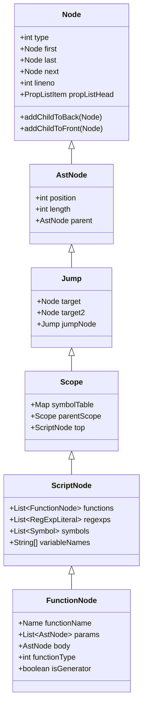
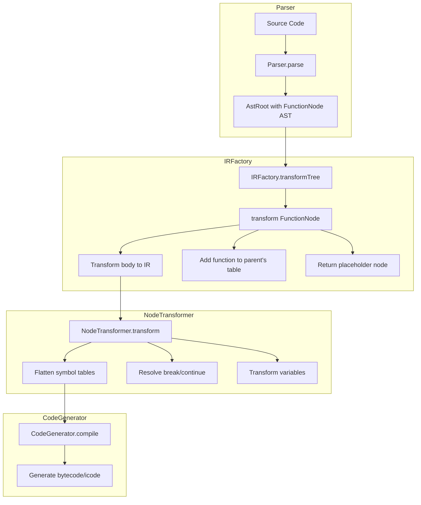
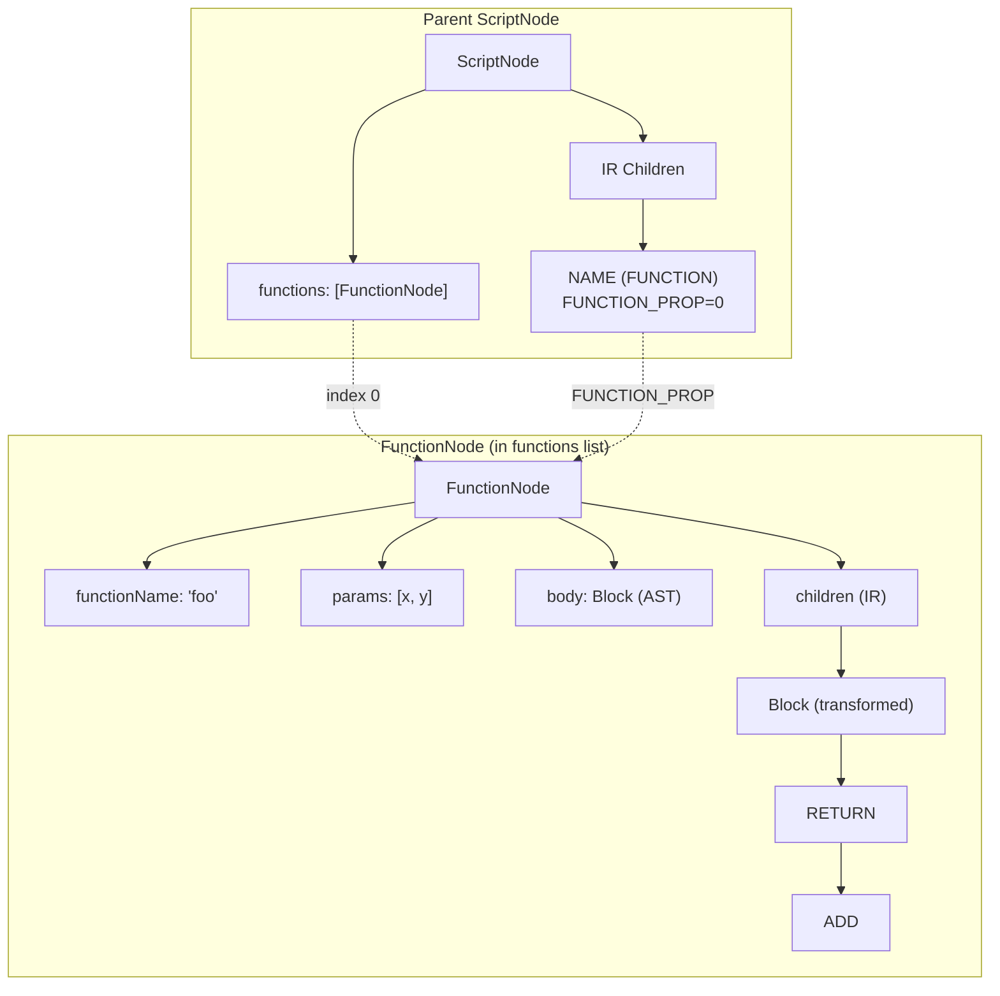
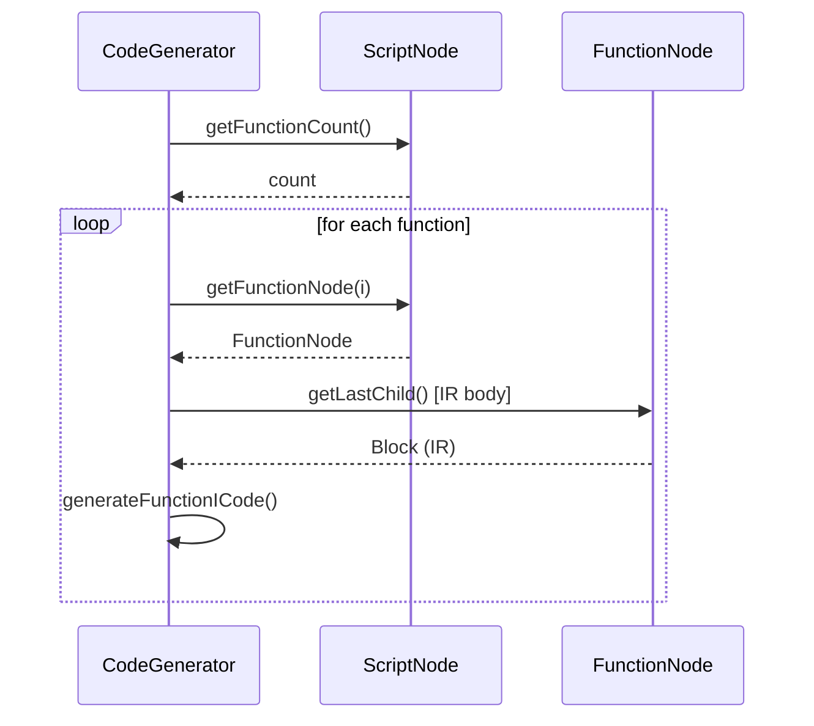

# Rhino AST and IR Architecture

This document explains how Rhino's Abstract Syntax Tree (AST) and Intermediate Representation (IR) nodes work together, with a focus on the function representation and the transformations between parsing and code generation.

## Overview

Rhino's node system is a hybrid design where AST nodes and IR nodes share a common base class. This creates a situation where:

1. **AST nodes are IR nodes**: All AST node classes extend `Node`, the IR base class
2. **Transformation happens in-place**: The IR transformation doesn't create new tree structures for most nodes; it modifies the existing AST nodes
3. **Mixed representations coexist**: After transformation, the tree contains a mix of original AST nodes (with modified children) and new IR-specific nodes

## Class Hierarchy



### Key Classes

| Class | Package | Role |
|-------|---------|------|
| `Node` | `o.m.javascript` | Base IR node with child list, type, properties |
| `AstNode` | `o.m.javascript.ast` | Base AST node with position, length, parent |
| `Jump` | `o.m.javascript.ast` | Control flow node with jump targets |
| `Scope` | `o.m.javascript.ast` | Lexical scope with symbol table |
| `ScriptNode` | `o.m.javascript.ast` | Script/function container with metadata |
| `FunctionNode` | `o.m.javascript.ast` | Function declaration/expression |

## The Dual Role of FunctionNode

`FunctionNode` is particularly interesting because it serves **two distinct roles**:

### 1. As an AST Node (Parser Output)

When created by the parser, `FunctionNode` has:
- `body` field: contains the function body as an AST `Block` node
- `params` field: contains parameter list as `AstNode` objects
- `functionName` field: the function's `Name` node
- Children (via `first`/`last`): **empty** or AST statements

### 2. As an IR Container (After IRFactory)

After IR transformation, `FunctionNode`:
- Still has `body` field pointing to original AST body (unused)
- Has IR-transformed statements as children via `first`/`last`
- Is referenced from parent's function table via `addFunction()`
- Has `FUNCTION_PROP` index stored in a placeholder node

## Transformation Pipeline



## Detailed Function Transformation

### Step 1: Parser Creates FunctionNode

```
FunctionNode
├── functionName: Name("foo")
├── params: [Name("x"), Name("y")]
├── body: Block (AST)
│   ├── ReturnStatement
│   │   └── InfixExpression (x + y)
├── first/last: null (no IR children yet)
└── functions: [] (no nested functions)
```

### Step 2: IRFactory.transformFunction()

The key method is `transformFunction()` at `IRFactory.java:640-723`:

```java
private Node transformFunction(FunctionNode fn) {
    // 1. Add function to parent's function table
    int index = parser.currentScriptOrFn.addFunction(fn);

    // 2. Transform the body (AST -> IR)
    Node body = transform(fn.getBody());

    // 3. Initialize function with transformed body
    Node pn = initFunction(fn, index, body, syntheticType);

    return pn;
}
```

### Step 3: initFunction() Adds Body to FunctionNode

At `IRFactory.java:1481-1530`:

```java
private Node initFunction(FunctionNode fnNode, int functionIndex,
                          Node statements, int functionType) {
    // Add IR body as child of FunctionNode!
    fnNode.addChildToBack(statements);

    // Add implicit return if needed
    if (lastStmt.getType() != Token.RETURN) {
        statements.addChildToBack(new Node(Token.RETURN));
    }

    // Return a PLACEHOLDER node (not the FunctionNode itself!)
    Node result = Node.newString(Token.FUNCTION, fnNode.getName());
    result.putIntProp(Node.FUNCTION_PROP, functionIndex);
    return result;
}
```

### After Transformation

```
ScriptNode (or parent FunctionNode)
├── functions: [FunctionNode reference]
└── children (IR):
    └── NAME node (type=FUNCTION, FUNCTION_PROP=0)
        └── String: "foo"

FunctionNode (stored in functions list)
├── functionName: Name("foo")
├── params: [Name("x"), Name("y")]
├── body: Block (original AST, now orphaned)
└── children (IR):
    └── Block (transformed body)
        └── RETURN
            └── ADD
                ├── NAME "x"
                └── NAME "y"
```



## Key Observations

### 1. The Body Field Becomes Orphaned

After `initFunction()`, the original `body` field of `FunctionNode` still holds the AST body, but this is no longer used. The IR-transformed body is added as children via `addChildToBack()`.

Reference: `IRFactory.java:1484`:
```java
fnNode.addChildToBack(statements);  // IR body becomes children
```

### 2. Functions Are Not Inlined

Functions are stored in a separate `functions` list on `ScriptNode`, not as children of their containing scope. A placeholder `NAME` node with `FUNCTION_PROP` points to the index.

Reference: `IRFactory.java:642`:
```java
int index = parser.currentScriptOrFn.addFunction(fn);
```

### 3. The Placeholder Pattern

The IR transformation returns a placeholder node instead of the `FunctionNode`:

Reference: `IRFactory.java:1527-1529`:
```java
Node result = Node.newString(Token.FUNCTION, fnNode.getName());
result.putIntProp(Node.FUNCTION_PROP, functionIndex);
return result;
```

### 4. Nested Functions Recursively Transform

When processing a function with nested functions, each nested function:
1. Gets added to the parent function's `functions` list
2. Has its body transformed recursively
3. Returns a placeholder in the parent's IR

Reference: `CodeGenerator.java:180-195`:
```java
private void generateNestedFunctions() {
    int functionCount = scriptOrFn.getFunctionCount();
    for (int i = 0; i != functionCount; i++) {
        FunctionNode fn = scriptOrFn.getFunctionNode(i);
        // Generate code for nested function
        gen.generateFunctionICode();
    }
}
```

## Code Generation Access Pattern

Both `CodeGenerator` (interpreter) and `Codegen` (optimizer) access functions through the function table:



Reference: `CodeGenerator.java:109`:
```java
generateICodeFromTree(theFunction.getLastChild());  // Gets IR body
```

## Why This Design?

### Historical Reasons
The comment in `AstNode.java:23-33` explains:

> The `AstNode` hierarchy sits atop the older `Node` class, which was designed for code generation. The `Node` class is a flexible, weakly-typed class suitable for creating and rewriting code trees...

### Trade-offs

| Aspect | Pro | Con |
|--------|-----|-----|
| Memory | No duplication of structure | Original AST data retained |
| Code | Reuses existing Node infrastructure | Confusing dual representation |
| Type Safety | Weak - runtime checks | `ClassCastException` possible |
| Debugging | Single tree to inspect | Hard to distinguish AST vs IR |

## Summary

The key insight is that **FunctionNode plays a dual role**:

1. **Container role**: Holds metadata (name, params, function table, symbols)
2. **IR node role**: Has IR-transformed body as children

After IR transformation:
- The `body` field (AST) is orphaned but still present
- The `children` list (via `first`/`last`) contains IR nodes
- The function is indexed in the parent's `functions` list
- A placeholder `NAME` node in the parent's IR references the function by index

This hybrid design means the same object is used throughout parsing, transformation, and code generation, but with different parts accessed at different stages.

## Appendix: Special Cases

### Member Expression Functions

Rhino supports a non-standard extension where you can define:
```javascript
function a.b.c(x) { return x; }
```

This is rewritten to:
```javascript
a.b.c = function(x) { return x; }
```

When this happens, `decompileFunctionHeader()` returns a non-null `mexpr`, and `transformFunction()` wraps the function placeholder in an assignment:

Reference: `IRFactory.java:705-715`:
```java
if (mexpr != null) {
    pn = createAssignment(Token.ASSIGN, mexpr, pn);
    if (syntheticType != FunctionNode.FUNCTION_EXPRESSION) {
        pn = createExprStatementNoReturn(pn, fn.getLineno(), fn.getColumn());
    }
}
```

### Generators

Generator functions receive special treatment. The `FunctionNode.isGenerator` flag is checked, and:
1. Resumption points are added for each `yield`
2. `NodeTransformer` marks `RETURN` nodes with `GENERATOR_END_PROP`
3. `CodeGenerator` emits special `Icode_GENERATOR` instructions

Reference: `NodeTransformer.java:149-151`:
```java
case Token.YIELD:
case Token.YIELD_STAR:
    ((FunctionNode) tree).addResumptionPoint(node);
    break;
```

### Default Parameters and Destructuring

Default parameters and destructuring assignments are handled during IR transformation by injecting conditional assignment statements at the front of the function body:

Reference: `IRFactory.java:657-701`:
```java
/* Process simple default parameters */
if (defaultParams != null) {
    // Inject: if (param === undefined) param = defaultValue;
    body.addChildToFront(createIf(...));
}

/* Transform destructuring */
if (destructuring != null) {
    body.addChildToFront(new Node(Token.EXPR_VOID, destructuring, ...));
}
