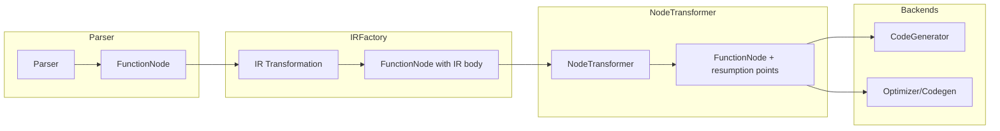
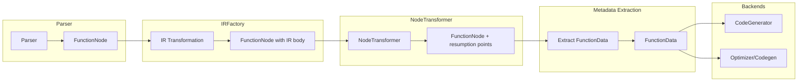

# Refactoring Plan: FunctionData - Minimal Extraction Approach

## Goal

Decouple `FunctionNode` (AST) from code generation backends by introducing a `FunctionData` class that captures the data needed after IR transformation, without over-engineering immutability or duplicating existing structures.

## Design Principles

1. **Minimal extraction**: Only include data actually accessed by backends
2. **Don't copy unnecessarily**: Reference existing structures where mutation isn't a concern
3. **Pragmatic mutability**: Accept that some referenced objects (like IR body) are mutable
4. **Separate from JSDescriptor**: Keep this as a distinct IR-phase artifact

## Current State



## Target State



## Data Analysis

### What Backends Actually Access

| Field/Method | CodeGenerator | Codegen/Optimizer | Include in FunctionData? |
|--------------|---------------|-------------------|--------------------------|
| `getName()` | Yes | Yes | ✅ Yes |
| `getParamCount()` | Yes | Yes | ✅ Yes |
| `getParamAndVarCount()` | Yes | Yes | ✅ Yes |
| `getParamOrVarName(i)` | Yes | Yes | ✅ Yes (as array) |
| `getParamAndVarConst()` | No | Yes | ✅ Yes (as array) |
| `getFunctionType()` | Yes | Yes | ✅ Yes |
| `isGenerator()` | Yes | Yes | ✅ Yes (packed flag) |
| `isES6Generator()` | Yes | Yes | ✅ Yes (packed flag) |
| `requiresActivation()` | Yes | Yes | ✅ Yes (packed flag) |
| `requiresArgumentObject()` | No | Yes | ✅ Yes (packed flag) |
| `isInStrictMode()` | Yes | Yes | ✅ Yes (packed flag) |
| `hasRestParameter()` | No | Yes | ✅ Yes (packed flag) |
| `getBaseLineno()` | Yes | Yes | ✅ Yes |
| `getEndLineno()` | No | Yes | ✅ Yes |
| `getSourceName()` | No | Yes | ✅ Yes |
| `getRegexpCount()` | Yes | Yes | ❌ Keep on ScriptNode |
| `getRegexpString(i)` | Yes | Yes | ❌ Keep on ScriptNode |
| `getRegexpFlags(i)` | Yes | Yes | ❌ Keep on ScriptNode |
| `getTemplateLiteralCount()` | Yes | Yes | ❌ Keep on ScriptNode |
| `getTemplateLiteralStrings(i)` | Yes | Yes | ❌ Keep on ScriptNode |
| `getFunctionCount()` | Yes | Yes | ✅ Yes (nested array length) |
| `getFunctionNode(i)` | Yes | Yes | ✅ Yes (as FunctionData[]) |
| `getResumptionPoints()` | No | Yes | ✅ Yes (reference) |
| `getLiveLocals()` | No | Yes | ✅ Yes (reference) |
| `getIndexForNameNode()` | Yes | Yes | ❌ Delegate to symbol table |
| `getLastChild()` (IR body) | Yes | Yes | ✅ Yes (reference) |

### What Stays on ScriptNode/FunctionNode

- Regexp literals (accessed by index, infrequent)
- Template literals (accessed by index, infrequent)
- Symbol table (used for `getIndexForNameNode()` lookups)
- Original AST body (orphaned after IR transformation)

## Proposed FunctionData Class

```java
package org.mozilla.javascript;

import java.util.List;
import java.util.Map;

/**
 * Captures function metadata needed by code generation backends.
 * Created after NodeTransformer completes processing.
 *
 * This class extracts the essential data from FunctionNode/ScriptNode
 * to break the coupling between AST nodes and code generators.
 */
public final class FunctionData {

    // --- Flags (packed into single int for efficiency) ---
    private static final int IS_GENERATOR = 1;
    private static final int IS_ES6_GENERATOR = 1 << 1;
    private static final int IS_STRICT = 1 << 2;
    private static final int REQUIRES_ACTIVATION = 1 << 3;
    private static final int REQUIRES_ARGUMENT_OBJECT = 1 << 4;
    private static final int HAS_REST_PARAMETER = 1 << 5;

    // --- Identity ---
    private final String name;
    private final int functionType; // FUNCTION_STATEMENT, FUNCTION_EXPRESSION, etc.

    // --- Parameters and variables (from flattened symbol table) ---
    private final String[] paramAndVarNames;
    private final boolean[] paramAndVarConst;
    private final int paramCount;

    // --- Packed boolean flags ---
    private final int flags;

    // --- Source location ---
    private final int baseLineno;
    private final int endLineno;
    private final String sourceName;

    // --- Nested functions ---
    private final FunctionData[] nestedFunctions;

    // --- IR body (reference to transformed tree) ---
    private final Node irBody;

    // --- Generator support (references, not copies) ---
    private final List<Node> resumptionPoints;  // may be null
    private final Map<Node, int[]> liveLocals;  // may be null

    // --- Back-reference for literal access (regexps, templates) ---
    private final ScriptNode scriptNode;

    /**
     * Create FunctionData from a FunctionNode after IR transformation.
     * Should be called after NodeTransformer has processed the tree.
     */
    public static FunctionData fromFunctionNode(FunctionNode fn) {
        // Build nested functions array
        int nestedCount = fn.getFunctionCount();
        FunctionData[] nested = new FunctionData[nestedCount];
        for (int i = 0; i < nestedCount; i++) {
            nested[i] = fromFunctionNode(fn.getFunctionNode(i));
        }

        return new FunctionData(fn, nested);
    }

    /**
     * Create FunctionData for a top-level script.
     */
    public static FunctionData fromScriptNode(ScriptNode script) {
        // Scripts are handled similarly but with some different defaults
        int nestedCount = script.getFunctionCount();
        FunctionData[] nested = new FunctionData[nestedCount];
        for (int i = 0; i < nestedCount; i++) {
            nested[i] = fromFunctionNode(script.getFunctionNode(i));
        }

        return new FunctionData(script, nested);
    }

    private FunctionData(ScriptNode node, FunctionData[] nestedFunctions) {
        this.scriptNode = node;
        this.nestedFunctions = nestedFunctions;

        // Identity
        if (node instanceof FunctionNode) {
            FunctionNode fn = (FunctionNode) node;
            this.name = fn.getName();
            this.functionType = fn.getFunctionType();
        } else {
            this.name = "";
            this.functionType = 0; // Script, not function
        }

        // Params and vars
        this.paramCount = node.getParamCount();
        int paramAndVarCount = node.getParamAndVarCount();
        this.paramAndVarNames = new String[paramAndVarCount];
        this.paramAndVarConst = new boolean[paramAndVarCount];
        for (int i = 0; i < paramAndVarCount; i++) {
            this.paramAndVarNames[i] = node.getParamOrVarName(i);
            this.paramAndVarConst[i] = node.getParamOrVarConst(i);
        }

        // Flags
        int flags = 0;
        if (node instanceof FunctionNode) {
            FunctionNode fn = (FunctionNode) node;
            if (fn.isGenerator()) flags |= IS_GENERATOR;
            if (fn.isES6Generator()) flags |= IS_ES6_GENERATOR;
            if (fn.requiresActivation()) flags |= REQUIRES_ACTIVATION;
            if (fn.requiresArgumentObject()) flags |= REQUIRES_ARGUMENT_OBJECT;
            if (fn.hasRestParameter()) flags |= HAS_REST_PARAMETER;
        }
        if (node.isInStrictMode()) flags |= IS_STRICT;
        this.flags = flags;

        // Source location
        this.baseLineno = node.getBaseLineno();
        this.endLineno = node.getEndLineno();
        this.sourceName = node.getSourceName();

        // IR body - last child of the node after transformation
        this.irBody = node.getLastChild();

        // Generator support (references only)
        if (node instanceof FunctionNode) {
            FunctionNode fn = (FunctionNode) node;
            this.resumptionPoints = fn.getResumptionPoints();
            this.liveLocals = fn.getLiveLocals();
        } else {
            this.resumptionPoints = null;
            this.liveLocals = null;
        }
    }

    // --- Getters ---

    public String getName() { return name; }
    public int getFunctionType() { return functionType; }
    public int getParamCount() { return paramCount; }
    public int getParamAndVarCount() { return paramAndVarNames.length; }
    public String getParamOrVarName(int i) { return paramAndVarNames[i]; }
    public boolean getParamOrVarConst(int i) { return paramAndVarConst[i]; }

    public boolean isGenerator() { return (flags & IS_GENERATOR) != 0; }
    public boolean isES6Generator() { return (flags & IS_ES6_GENERATOR) != 0; }
    public boolean isInStrictMode() { return (flags & IS_STRICT) != 0; }
    public boolean requiresActivation() { return (flags & REQUIRES_ACTIVATION) != 0; }
    public boolean requiresArgumentObject() { return (flags & REQUIRES_ARGUMENT_OBJECT) != 0; }
    public boolean hasRestParameter() { return (flags & HAS_REST_PARAMETER) != 0; }

    public int getBaseLineno() { return baseLineno; }
    public int getEndLineno() { return endLineno; }
    public String getSourceName() { return sourceName; }

    public int getFunctionCount() { return nestedFunctions.length; }
    public FunctionData getFunction(int i) { return nestedFunctions[i]; }

    public Node getIRBody() { return irBody; }

    public List<Node> getResumptionPoints() { return resumptionPoints; }
    public Map<Node, int[]> getLiveLocals() { return liveLocals; }

    // --- Delegated access to ScriptNode for literals ---

    public int getRegexpCount() { return scriptNode.getRegexpCount(); }
    public String getRegexpString(int i) { return scriptNode.getRegexpString(i); }
    public String getRegexpFlags(int i) { return scriptNode.getRegexpFlags(i); }

    public int getTemplateLiteralCount() { return scriptNode.getTemplateLiteralCount(); }
    public List<TemplateCharacterData> getTemplateLiteralStrings(int i) {
        return scriptNode.getTemplateLiteralStrings(i);
    }

    public int getIndexForNameNode(Node nameNode) {
        return scriptNode.getIndexForNameNode(nameNode);
    }
}
```

## Phased Implementation Plan

### Phase 1: Create FunctionData (Non-Breaking)

**Goal:** Introduce the new class without changing existing behavior.

**Tasks:**
1. Create `FunctionData` class with all fields and factory methods
2. Add unit tests for `FunctionData` extraction
3. Verify extraction captures all needed data

**Files:**
- New: `rhino/src/main/java/org/mozilla/javascript/FunctionData.java`
- New: `rhino/src/test/java/org/mozilla/javascript/FunctionDataTest.java`

**Validation:** Existing tests pass, `FunctionData` can be created from any `FunctionNode`.

### Phase 2: Integrate into CodeGenerator

**Goal:** Create `FunctionData` in CodeGenerator and start using it.

**Tasks:**
1. Create `FunctionData` after `NodeTransformer.transform()` completes
2. Add a `FunctionData` field alongside existing `scriptOrFn`
3. Incrementally migrate access from `scriptOrFn` to `FunctionData`:
   - Start with simple getters (name, paramCount, flags)
   - Move to nested function access
   - Finally migrate IR body access
4. Keep `scriptOrFn` for regexp/template access (via delegation)

**Files:**
- Modify: `rhino/src/main/java/org/mozilla/javascript/CodeGenerator.java`

**Validation:** All interpreter tests pass.

### Phase 3: Integrate into Codegen/Optimizer

**Goal:** Migrate optimizer backend to use `FunctionData`.

**Tasks:**
1. Create `FunctionData` in `Codegen.compile()` after transformation
2. Refactor `OptFunctionNode`:
   - Change `public final FunctionNode fnode` to `public final FunctionData data`
   - Keep optimizer-specific fields (`directTargetIndex`, `numberVarFlags`, etc.)
   - Update all delegating methods
3. Update `Codegen.java` access patterns
4. Update `BodyCodegen.java` access patterns
5. Update `Optimizer.java` and `Block.java` access patterns

**Files:**
- Modify: `rhino/src/main/java/org/mozilla/javascript/optimizer/OptFunctionNode.java`
- Modify: `rhino/src/main/java/org/mozilla/javascript/optimizer/Codegen.java`
- Modify: `rhino/src/main/java/org/mozilla/javascript/optimizer/BodyCodegen.java`
- Modify: `rhino/src/main/java/org/mozilla/javascript/optimizer/Optimizer.java`
- Modify: `rhino/src/main/java/org/mozilla/javascript/optimizer/Block.java`

**Validation:** All optimizer tests pass.

### Phase 4: Remove Direct FunctionNode Access

**Goal:** Backends no longer directly access `FunctionNode`.

**Tasks:**
1. Remove `scriptOrFn` field from `CodeGenerator` (use only `FunctionData`)
2. Remove `fnode` field from `OptFunctionNode`
3. Audit all backend code for remaining `FunctionNode` imports/usage
4. Update `FUNCTION_PROP` handling if needed

**Files:**
- Modify: `rhino/src/main/java/org/mozilla/javascript/CodeGenerator.java`
- Modify: `rhino/src/main/java/org/mozilla/javascript/optimizer/OptFunctionNode.java`
- Possibly others discovered during audit

**Validation:** No `FunctionNode` access in backend code paths.

### Phase 5: Consider JSDescriptor Simplification

**Goal:** Evaluate if `JSDescriptor.Builder` can use `FunctionData` as input.

**Tasks:**
1. Analyze overlap between `FunctionData` and `JSDescriptor`
2. If beneficial, add `JSDescriptor.Builder.from(FunctionData)` method
3. Simplify `CodeGenUtils.fillInFor*` methods

**Files:**
- Modify: `rhino/src/main/java/org/mozilla/javascript/JSDescriptor.java`
- Modify: `rhino/src/main/java/org/mozilla/javascript/CodeGenUtils.java`

**Validation:** All tests pass, cleaner descriptor construction.

## Open Questions

### 1. When Exactly to Create FunctionData

**TBD**: The plan shows creation after `NodeTransformer`, but the exact integration point needs to be determined:

- **Option A**: In `CodeGenerator.compile()` / `Codegen.compile()` after `NodeTransformer.transform()`
- **Option B**: At the end of `NodeTransformer.transform()` itself
- **Option C**: Lazy creation on first access

Current recommendation: **Option A** - keeps it explicit and doesn't modify NodeTransformer.

### 2. ScriptNode Back-Reference

The current design keeps a reference to `ScriptNode` for regexp/template literal access. Alternatives:
- Copy regexp/template data into `FunctionData` (more duplication)
- Accept the back-reference (simpler, chosen approach)
- Create a separate `LiteralData` holder

## Key Differences from Original Plan

| Aspect | Original IRFunctionMetadata | This FunctionData |
|--------|----------------------------|-------------------|
| Creation point | `IRFactory.initFunction()` | After NodeTransformer |
| Builder pattern | Yes | No (all data available) |
| Immutability claim | "Immutable" | Pragmatically final |
| Regexp/templates | Copied into metadata | Delegated to ScriptNode |
| Symbol table | Copied | Not included (use delegation) |
| Nested functions | Stored directly | Stored directly |
| Complexity | Higher | Lower |

## Success Criteria

1. ✅ No direct `FunctionNode` access in `CodeGenerator`
2. ✅ No direct `FunctionNode` access in `Codegen`/`Optimizer`
3. ✅ All existing tests pass
4. ✅ `OptFunctionNode.fnode` replaced with `OptFunctionNode.data`
5. ✅ Clear separation: AST nodes stay in parser/IRFactory, `FunctionData` used in backends

## Risk Assessment

| Risk | Likelihood | Impact | Mitigation |
|------|------------|--------|------------|
| Missing data field | Medium | Low | Start with superset, remove unused |
| Performance regression | Low | Medium | Benchmark Phase 3 |
| Serialization issues | Low | Medium | Ensure Serializable if needed |
| Regexp/template delegation breaks | Low | Low | Tests will catch |
| Optimizer-specific state issues | Medium | Medium | Keep in OptFunctionNode |
