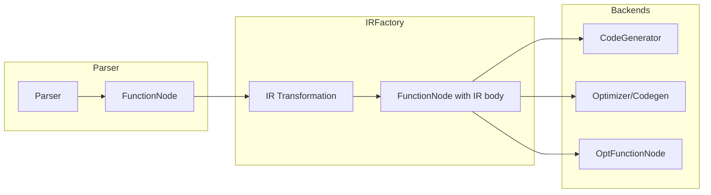
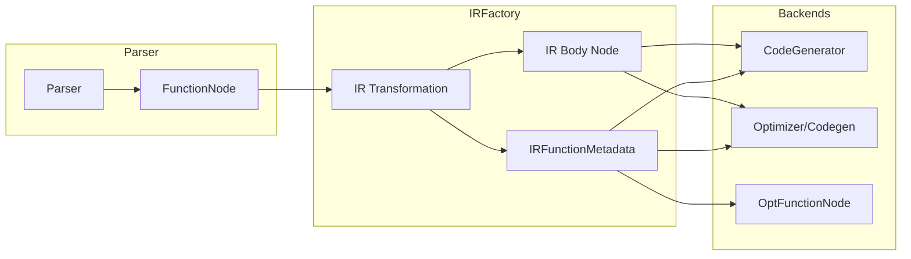

# Refactoring Plan: Separate IR Function Representation from AST

## Goal

Decouple `FunctionNode` (AST) from the code generation backends by introducing an `IRFunctionMetadata` class that captures all information needed after IR transformation.

## Current State



**Problems:**
1. `FunctionNode` serves dual role (AST container + IR metadata holder)
2. Backends directly access AST node fields
3. `OptFunctionNode` wraps `FunctionNode` but still delegates to it
4. Tight coupling prevents future AST/IR separation

## Target State



## Data Analysis

### Information Accessed by Backends

| Field/Method | CodeGenerator | Codegen/Optimizer | Source |
|--------------|---------------|-------------------|--------|
| `getName()` | Yes | Yes | FunctionNode |
| `getParamCount()` | Yes | Yes | ScriptNode |
| `getParamAndVarCount()` | Yes | Yes | ScriptNode |
| `getParamOrVarName(i)` | Yes | Yes | ScriptNode |
| `getParamAndVarConst()` | No | Yes | ScriptNode |
| `getFunctionType()` | Yes | Yes | FunctionNode |
| `isGenerator()` | Yes | Yes | FunctionNode |
| `isES6Generator()` | Yes | Yes | FunctionNode |
| `requiresActivation()` | Yes | Yes | FunctionNode |
| `requiresArgumentObject()` | No | Yes | FunctionNode |
| `isInStrictMode()` | Yes | Yes | ScriptNode |
| `hasRestParameter()` | No | Yes | FunctionNode |
| `getBaseLineno()` | Yes | Yes | ScriptNode |
| `getEndLineno()` | No | Yes | ScriptNode |
| `getSourceName()` | No | Yes | ScriptNode |
| `getRegexpCount()` | Yes | Yes | ScriptNode |
| `getRegexpString(i)` | Yes | Yes | ScriptNode |
| `getRegexpFlags(i)` | Yes | Yes | ScriptNode |
| `getTemplateLiteralCount()` | Yes | Yes | ScriptNode |
| `getTemplateLiteralStrings(i)` | Yes | Yes | ScriptNode |
| `getFunctionCount()` | Yes | Yes | ScriptNode |
| `getFunctionNode(i)` | Yes | Yes | ScriptNode |
| `getResumptionPoints()` | No | Yes | FunctionNode |
| `getLiveLocals()` | No | Yes | FunctionNode |
| `getIndexForNameNode()` | Yes | Yes | ScriptNode |
| `getLastChild()` (IR body) | Yes | Yes | Node |

### Information Set During IR Transformation

| Field | Set By | When |
|-------|--------|------|
| Function type | `initFunction()` | After body transform |
| Requires activation | `initFunction()` | If nested functions |
| Symbols added | `putSymbol()` | During symbol resolution |
| Resumption points | `NodeTransformer` | When yield found |
| IR body children | `addChildToBack()` | In `initFunction()` |

## Proposed IRFunctionMetadata Class

```java
package org.mozilla.javascript;

import java.util.List;
import java.util.Map;

/**
 * Immutable container for function metadata needed during code generation.
 * Created by IRFactory after transforming a FunctionNode.
 */
public final class IRFunctionMetadata {
    // Identity
    private final String name;
    private final int functionType; // FUNCTION_STATEMENT, FUNCTION_EXPRESSION, etc.

    // Parameters and variables
    private final int paramCount;
    private final String[] paramAndVarNames;
    private final boolean[] paramAndVarConst;

    // Flags
    private final boolean isGenerator;
    private final boolean isES6Generator;
    private final boolean isStrict;
    private final boolean requiresActivation;
    private final boolean requiresArgumentObject;
    private final boolean hasRestParameter;

    // Source info
    private final int baseLineno;
    private final int endLineno;
    private final String sourceName;

    // Literals (owned, not shared)
    private final List<RegExpLiteralData> regexps;
    private final List<TemplateLiteralData> templateLiterals;

    // Nested functions (by index, resolved later)
    private final int nestedFunctionCount;

    // Generator support
    private final List<Node> resumptionPoints;
    private final Map<Node, int[]> liveLocals;

    // The IR body (root of transformed statements)
    private final Node irBody;

    // Symbol table for variable resolution
    private final Map<String, Symbol> symbolTable;

    // ... constructor, getters ...

    /**
     * Data class for regexp literals.
     */
    public static final class RegExpLiteralData {
        public final String pattern;
        public final String flags;
        // constructor...
    }

    /**
     * Data class for template literals.
     */
    public static final class TemplateLiteralData {
        public final List<TemplateCharacterData> strings;
        // constructor...
    }
}
```

## Phased Implementation Plan

### Phase 1: Create IRFunctionMetadata (Non-Breaking)

**Goal:** Introduce the new class without changing existing behavior.

**Tasks:**
1. Create `IRFunctionMetadata` class with all required fields
2. Create `IRFunctionMetadata.Builder` for incremental construction
3. Add factory method in `IRFactory` to create metadata from `FunctionNode`
4. Store `IRFunctionMetadata` in a new property on the placeholder node (alongside existing `FUNCTION_PROP`)

**Files to modify:**
- New: `rhino/src/main/java/org/mozilla/javascript/IRFunctionMetadata.java`
- Modify: `IRFactory.java` (add metadata creation in `initFunction()`)

**Validation:** Existing tests pass, metadata is created but unused.

### Phase 2: Update CodeGenerator to Use IRFunctionMetadata

**Goal:** Migrate interpreter backend to use new metadata.

**Tasks:**
1. Change `scriptOrFn` field type from `ScriptNode` to use `IRFunctionMetadata`
2. Create adapter methods that delegate to metadata
3. Update all access patterns:
   - `scriptOrFn.getParamCount()` → `metadata.getParamCount()`
   - `scriptOrFn.getFunctionNode(i)` → `metadata.getNestedFunction(i)`
   - etc.
4. Handle nested functions: store list of `IRFunctionMetadata` instead of indices

**Files to modify:**
- `rhino/src/main/java/org/mozilla/javascript/CodeGenerator.java`
- `rhino/src/main/java/org/mozilla/javascript/Interpreter.java` (if needed)

**Validation:** All interpreter tests pass.

### Phase 3: Update Codegen/Optimizer to Use IRFunctionMetadata

**Goal:** Migrate optimizer backend to use new metadata.

**Tasks:**
1. Refactor `OptFunctionNode` to wrap `IRFunctionMetadata` instead of `FunctionNode`
2. Update `Codegen.java` access patterns
3. Update `BodyCodegen.java` access patterns
4. Update `Optimizer.java` and `Block.java` access patterns
5. Update `OptTransformer.java` if needed

**Files to modify:**
- `rhino/src/main/java/org/mozilla/javascript/optimizer/OptFunctionNode.java`
- `rhino/src/main/java/org/mozilla/javascript/optimizer/Codegen.java`
- `rhino/src/main/java/org/mozilla/javascript/optimizer/BodyCodegen.java`
- `rhino/src/main/java/org/mozilla/javascript/optimizer/Optimizer.java`
- `rhino/src/main/java/org/mozilla/javascript/optimizer/Block.java`

**Validation:** All optimizer tests pass.

### Phase 4: Update JSDescriptor to Build from IRFunctionMetadata

**Goal:** Simplify `JSDescriptor.Builder` by using `IRFunctionMetadata` as source.

**Tasks:**
1. Add method to create `JSDescriptor.Builder` from `IRFunctionMetadata`
2. Update `CodeGenUtils.fillInFor*` methods to use metadata
3. Remove direct `FunctionNode` access from descriptor building

**Files to modify:**
- `rhino/src/main/java/org/mozilla/javascript/JSDescriptor.java`
- `rhino/src/main/java/org/mozilla/javascript/CodeGenUtils.java`

**Validation:** All tests pass.

### Phase 5: Remove FunctionNode Access from Backends

**Goal:** Complete the decoupling.

**Tasks:**
1. Remove `getFunctionNode(i)` calls from backends
2. Store `IRFunctionMetadata[]` instead of function indices in parent
3. Update `FUNCTION_PROP` to point to `IRFunctionMetadata` instead of index
4. Remove orphaned `body` field access from `FunctionNode` post-transform

**Validation:** All tests pass, no direct `FunctionNode` access in backends.

### Phase 6: Cleanup (Optional)

**Goal:** Remove dead code and simplify.

**Tasks:**
1. Consider removing `compilerData` field from `ScriptNode`
2. Consider making `FunctionNode.body` field immutable after parsing
3. Document the new architecture
4. Add assertions that `FunctionNode` is not accessed after IR transformation

## Key Design Decisions

### 1. Nested Functions Representation

**Option A:** Store nested `IRFunctionMetadata` objects directly
- Pro: Clean, self-contained
- Con: Memory duplication if same function referenced multiple times

**Option B:** Store indices, resolve via parent metadata
- Pro: Matches current behavior
- Con: Requires parent reference

**Recommendation:** Option A - store direct references. Functions are not shared.

### 2. IR Body Ownership

**Option A:** `IRFunctionMetadata` owns the IR body node
- Pro: Complete encapsulation
- Con: Need to extract from `FunctionNode` children

**Option B:** IR body stored separately, metadata references it
- Pro: Simpler extraction
- Con: Two objects to manage

**Recommendation:** Option A - metadata owns the body for encapsulation.

### 3. Symbol Table Handling

**Option A:** Copy symbol table into metadata
- Pro: Immutable, no external dependencies
- Con: Memory overhead

**Option B:** Reference existing symbol table
- Pro: No copy
- Con: Mutable state leakage

**Recommendation:** Option A - copy for immutability. Symbol tables are small.

### 4. Backward Compatibility

During transition, support both access patterns:
```java
// Old way (deprecated, to be removed)
FunctionNode fn = scriptOrFn.getFunctionNode(i);
int paramCount = fn.getParamCount();

// New way
IRFunctionMetadata meta = getMetadata(i);
int paramCount = meta.getParamCount();
```

## Risk Mitigation

| Risk | Mitigation |
|------|------------|
| Breaking existing tests | Phase-by-phase with full test runs |
| Performance regression | Benchmark before/after Phase 3 |
| Serialization issues | Ensure IRFunctionMetadata is Serializable |
| Missing data | Start with superset of all accessed fields |
| Circular dependencies | Keep IRFunctionMetadata in base package |

## Success Metrics

1. No direct `FunctionNode` access in `CodeGenerator`, `Codegen`, `Optimizer`
2. All existing tests pass
3. No performance regression (< 5% slowdown acceptable)
4. `IRFunctionMetadata` is immutable after creation
5. Clear separation: AST nodes used only in parser/IRFactory, metadata used in backends

## Estimated Effort

| Phase | Effort | Risk |
|-------|--------|------|
| Phase 1 | Small | Low |
| Phase 2 | Medium | Medium |
| Phase 3 | Large | Medium |
| Phase 4 | Small | Low |
| Phase 5 | Medium | Medium |
| Phase 6 | Small | Low |

Total: Significant refactoring, recommend doing in multiple PRs.
